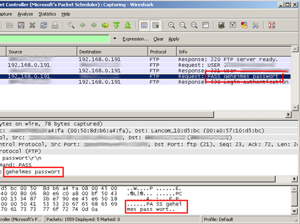
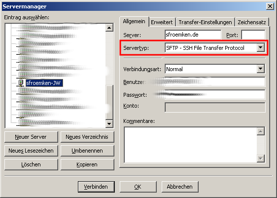

+++
title = "SFTP mit FileZilla"
date = 2024-01-09T20:59:48+01:00
aliases = ["sftp-mit-filezilla.html"]
+++

Es gibt immer mehr Malware, Trojaner oder was auch immer, die sich sehr für Eure FTP-Passwörter interessieren. Sie hören die ganze Zeit Euren Internetverkehr ab und versuchen FTP-Passwörter auszuspionieren, um dann einen Trojaner auf Eure Webseite zu platzieren. Dieser verseucht dann jeden Besucher mit einem Virus oder richtet sonst irgendwelchen Schaden an.

Klar, die erste Lösung überhaupt ist, den Virus vom eigenen System zu verbannen, aber ich möchte hier noch eine andere Schadensbegrenzung vorstellen

## Verschlüsseltes Passwort mit FileZilla

Das Standard-Übertragungsprotokoll ist FTP. Bei diesem Protokoll werden die Daten und auch das Passwort unverschlüsselt (als lesbarer Text) über das Internet zum Server übertragen. Ich habe auf meinem Rechner extra mal die Software WireShark installiert und konnte das Passwort lesen!

Öffnet FileZilla und geht dann auf Datei->Servermanager. Dort angekommen wählt Ihr nun den gewünschten Server aus oder legt einen neuen an. Rechts im Tab "Allgemein" findet ihr eine Einstellung mit dem Namen `Servertyp`. In dieser Selectbox wählt ihr `SFTP - SSH File Transfer Protocol` aus.

Nach einem Klick auf `OK`, könnt Ihr Euch nun verschlüsselt mit dem Server verbinden. Auch das habe ich mit WireShark getestet. Es wird nichts mehr per FTP (Port 21) gesendet. Ab jetzt läuft alles über den Port 22 (SSH) und von leserlichen Daten fehlt jede Spur. Ich bin wirklich jedes Paket durchgegangen.

## Es klappt nicht mit dem SFTP?

Der Server zu dem Ihr Euch verbinden wollt, muss Anfragen auf den Port 22 erlauben, sonst läuft da gar nichts. Bei jWeiland (meinem Provider) ist Port 22 geöffnet und ich kann mich über Port 22 und meinen ganz normalen FTP-Zugangsdaten darauf verbinden (getestet mit Putty).

Bei meinem Hosteurope-Account sah das schon etwas anders aus. Dort kann ich mich zwar mit meinem normalen SSH-Account an Port 22 anmelden, nicht aber mit meinen FTP-Zugangsdaten. Es ist also wichtig, dass der Server so eingerichtet ist, dass der FTP-User nach Anmeldung eine Shell wie /bin/bash erhält. Auf unserem Hosteuropeserver gab es im Plesk sogar die besser Option `/bin/bash (chrooted)` auszuwählen. Damit zwinge ich den FTP-User in seinem Homeverzeichnis zu bleiben. Er kann also nicht mal eben die `/etc/passwd` auslesen.

Kurz: Auf dem Server muss der FTP-User so eingerichtet sein, dass er nach Anmeldung über den Port 22 eine Shell erhält. Wenn das der Fall ist, klappt auch SFTP per FileZilla.

## Sonderfall Hosteurope

Ich habe mich bereits mit Hosteurope über dieses Thema unterhalten und auch hier funktioniert die sichere FTP-Verbindung. Allerdings muss hier nicht SFTP sondern FTPES ausgewählt werden. Auch hier erhaltet Ihr ein Zertifikat, das Ihr bestätigen müsst.

## Unbekannter Server-Schlüssel

SSH funktioniert mit Zertifikaten, die dem Client (FileZilla) mitteilen, dass es sich auch wirklich um den Server handelt, den wir aufrufen wollen. Solche Zertifikate kosten normalerweise zwischen 100 und 300 € pro Jahr. Dem ist einfach so, weil große Zertifizierungsstellen, die Webseite überprüfen, testen und was weiß ich noch, um dem Provider ein Zertifikat zu erteilen, das als gültig markiert werden muss. Also viel zu teuer für die Provider. Deshalb erzeugen viele Provider eigene Zertifikate, die nicht von zertifizierten Stellen abgesegnet wurden. Das ist völlig legal und kann eigentlich jeder machen mit z.B. `puttygen`.

FileZilla hat also das Zertifikat vom Server erhalten und schickt das nun zu sämtlichen Zertifizierungsstellen und erhält von allen ein "nicht gültig" oder "nicht gefunden". Damit weiß FileZilla, dass es sich um ein selbst signiertes Zertifikat handelt und quittiert dies mit folgender Meldung am Bildschirm:

> Unbekannter Server-Schlüssel
> Der Server-Schlüssel ist unbekannt. Daher kann nicht garantiert werden, dass der
Server wirklich derjenige ist, mit dem Sie sich verbinden wollen

Ich sage mal ganz unverbindlich, dass ihr diese Meldung bei Providern wie jWeiland, 1und1, Strato und allen anderen größeren Providern unbedenklich mit `OK` bestätigen könnt.
